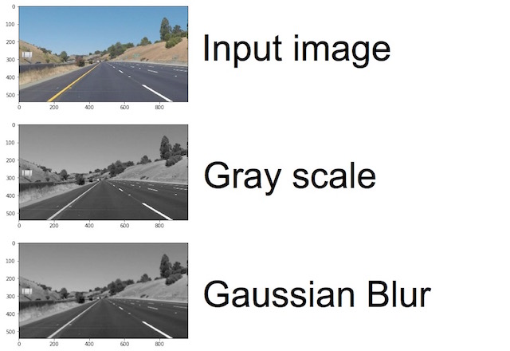
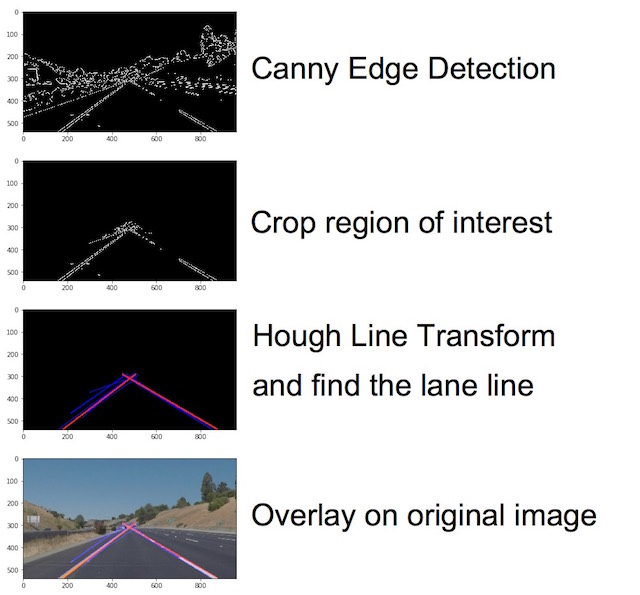
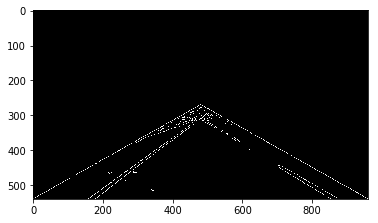
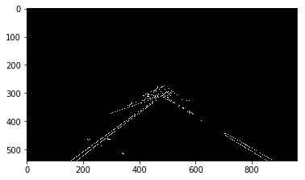
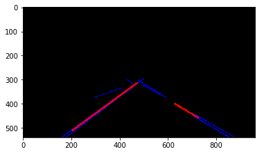
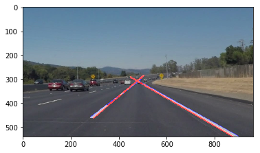
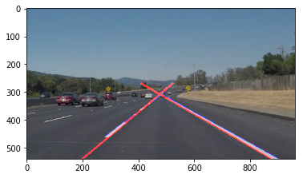

# **Finding Lane Lines on the Road** 


---

**Finding Lane Lines on the Road**

This report shows how I use methods learned from the lesson "Computer Vision Fundanmentals" in the SDC class to finding lane lines in given images and video clips.

[](http://www.youtube.com/watch?v=4YzheUjWGNE "Sample output YouTube Video")

---


### 1. Pipeline building

The base example project comes with serveral useful helper function suchs as grayscale, blur, canny for preprocessing the image. It seems all we need to do is building a pipeline with these building blocks. Which are shown below:




#### Finding: What did I got for cropping region of interest before applying Canny Edge Detection



When building the pipeline, I tried to crop the image before Canny Edge Detection, but the output seems unusable for following processing.
The boundry in cropped area will become the longest line after Hough Line Transformation. So we have a conclusion of that the output will be better if we crop the region of interest after the Canny filter.



#### Implementation of lane line finding (choosing) function
Since we will have many line segments after Hough Line Transformation. We try to averaging them to figure out the final lane line.



As the image shown above, we got serveal lines after the Hough Line Transformation (the blue ones). We calculate final lane line by averaging the lines we with their coordinates. After testing with various inputs, I discard lines with slope < 0.5 when calculating the average, which will be something line from a bridge.

As red lines shown above, we calculate left and right lane separately. One in postive slope and one in negative slope as our left and right lane line.

#### Extrapolate the lane lines


In some case the line is shorten due to it's a broken center line. I tried to extrapolate it by finding its equation as y=ax+b:

```
        a = (y2-y1)/(x2-x1)
        b = y1-a*x1

```

Applying y=(height of the image) and y=(height of the image)/2 to the equation and we can have new x values for the extrapolated line.



### 2. Identify potential shortcomings with your current pipeline


Since I only apply gray and canny filtering to get original line segments. The output will be drifting it there's something like a long line appears in the image, such like the refuge island. Extrapolate lane is only a straight line, which make the output seems weird when the car faces a corner.

### 3. Suggest possible improvements to your pipeline

We may try to do more filtering in preprocessing (related to colour)to mitigate the influence from objects not on the road.
